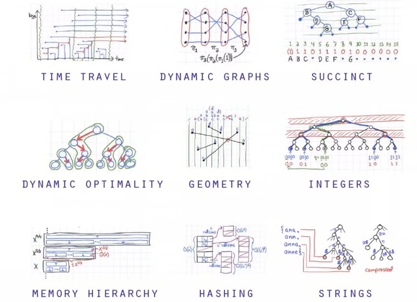

# Data-Structures-in-Java
Repositório criado para fins estudantis, criado para me aprofundar em estrutura de dados na linguagem JAVA.

# Conteúdo:

### O que são estrutura de dados?
É uma estrutura de dados que armazena/organiza dados/infomações de modo que possam ser acessados e manipulados de forma eficiente.




### Estrutura de dados 
   <details>
  <summary>Vetores (Arrays)</summary>
  
  <br>
  
  - **Criação de um Vetor**  
    - Exemplo de criação de um vetor:  
      ```java
      tipo[] novo_array = new tipo[tamanho];
      ```

  - **Iterando um Vetor**  
    - Exemplo de iteração usando um `for`:  
      ```java
      for (int i = 0; i < novo_array.length; i++) {
          // Acessando o elemento do vetor
          System.out.println(novo_array[i]);
      }
      ```

      - Exemplo de iteração usando um `foreach`:
      ```java
      for (tipo elemento : novo_array) {
        // Acessando o elemento do vetor
        System.out.println(elemento);
      }
      ```

   - **Classe Vetor utilizada**

  ```java
    public class Vetor{
    private String[] elementos;
    private int tamanho;

      public Vetor(int capacidade){
          this.elementos = new String[capacidade];
          this.tamanho = 0;
      }
    }
  ```

  - **Adicionando elemento no final do vetor**  

  ```java
     public void adicionaElemento(String elemento) throws Exception{
        //Itera os elementos dentro do array e aumenta o tamanho até o seu limite total
        if(this.tamanho < this.elementos.length){
            this.elementos[this.tamanho] = elemento;
            this.tamanho++;
        }
        else{
            throw new Exception("Vetor já está cheio, não é possivel adicionar mais elementos");
        }
    }
  ```

  - **Verificando a quantidade de elementos no vetor**  
  ```java
    public int tamanho(){
        return this.tamanho;
    }
  ``` 
  - **Imprimindo os elementos do vetor**  
  ```java
    @Override
    public String toString(){
        return "Vetor [elementos=" + Arrays.toString(elementos) 
                        + ", tamanho=" 
                        + tamanho + "]";
    }
  ``` 

  - **Verificando se um elemento existe no vetor**  
  - **Adicionando elemento em qualquer posição**  
  - **Adicionando mais capacidade ao vetor**  
  - **Removendo elemento do vetor**  
  - **Generalizando o tipo dos elementos**  
  - **Definindo o tipo do vetor dinamicamente**

</details>

- Pilhas(Stacks)
- Filas(Queues)
- Listas encadeadas(Linked Lists)
- Listas Duplamente Encadeadas(Doubly-Linked Lists)
- Conjuntos(Sets)
- Tabelas de Hashing(HashTables)
- Arvores(Trees)
- Grafos(Graphs)

### Algoritmos
- Algoritmos de Ordenação
  *  Bolha (Bubbe Sort)
  *  Seleção (Selection Sort)
  *  Inserção (Inserction Sort)
  *  Merge Sort
  *  Quick Sort

- Algoritmos de Busca/Pesquisa
   * Busca Sequencial
   * Busca Binaria

#### Qual estrutura de dados você usaria ?

- Buscar uma coleção de registros do banco de dados ?

- Registro de chamadas de métodos e funções de um compilador ?

- Sistema de bancos, hospitais ?

- Manipular uma coleção de registros únicos ?

- Organizar Relacionamentos de redes sociais (Twitter, Facebook) ?
